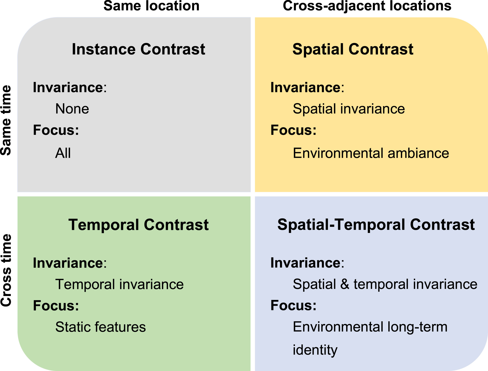
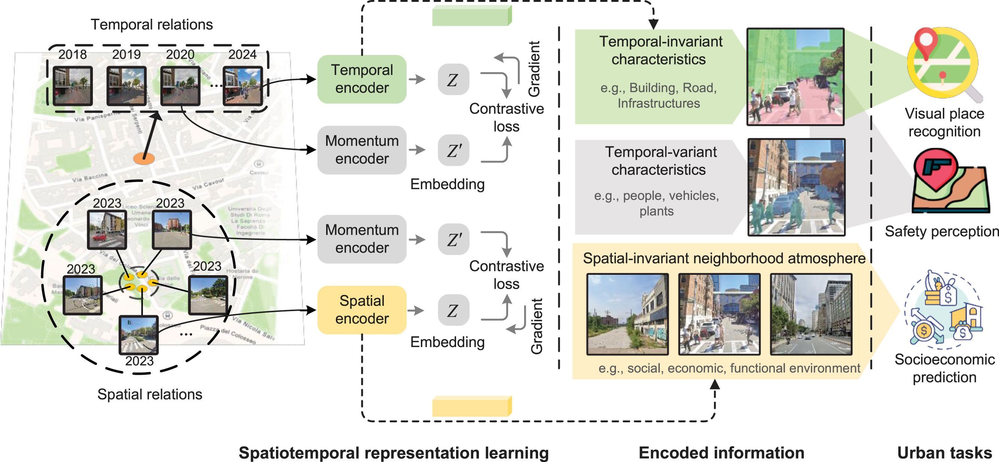

# UrbanSTCL — Spatiotemporal Contrastive Learning for Urban Scenes

This folder contains code used for **UrbanSTCL** experiments (pretraining + downstream tasks + analysis utilities) inside the `svpretrain` workspace.


Official project page (from the paper): *Learning street view representations based on a spatiotemporal contrastive learning framework*


<p align="center">
  
  <br/>
  <em>Fig. 1. Spatiotemporal contrastive learning framework.</em>
</p>

<p align="center">
  
  <br/>
  <em>Fig. 2. Strategy implementation diagram.</em>
</p>

## Project structure

```
UrbanSTCL/
  pretrain/                 # self-supervised pretraining + linear eval + feature extraction
  downstream_tasks/         # downstream tasks (e.g. place recognition)
  analysis/                 # analysis utilities
  assets/                   # figures used in README
  weights/                  # (local) pretrained checkpoints (not tracked by git)
```

Key entrypoints:

- Pretraining (`train.sh`): `pretrain/moco_gsv.py`
- Linear evaluation: `pretrain/main_lincls.py`
- Feature extraction: `pretrain/main_test_gsv1m_feature.py`
- Place recognition downstream task: `downstream_tasks/place_recognition/`

## Environment

### Requirements (minimal)

- Python 3.8+ recommended
- PyTorch + torchvision (CUDA build if using GPUs)
- Common python deps used by scripts in this folder: `timm`, `tensorboard`, `pandas`, `tqdm`, `numpy`, `Pillow`

Example setup (pip):

```bash
python -m venv .venv
source .venv/bin/activate

# Install PyTorch following https://pytorch.org/get-started/locally/ (CUDA/ROCm/CPU)
pip install -U pip
pip install timm tensorboard pandas tqdm numpy pillow
```

If you plan to run **place recognition** downstream code, install its pinned deps:

```bash
pip install -r downstream_tasks/place_recognition/requirements.txt
```

## Pretraining (MoCo v3 style)

### GSV-style training from pickled metadata (`train.sh`)

This workspace includes an experiment script:

- `pretrain/train.sh`

It contains three runs labeled **Self / Spatial / Temporal** and invokes `python moco_gsv.py ...` with `.pkl` inputs such as:

- `self_cities10_1m.pkl`
- `spatial_5k100t_cities10_1m_new.pkl`
- `temporal_random_cities10t_1m.pkl`

Implementation notes:

- `pretrain/moco_gsv.py` is a thin wrapper that delegates to `moco-v3/moco_gsv.py` (so `train.sh` can run from `UrbanSTCL/pretrain/`).
- Expected `.pkl` columns (as implemented in `moco-v3/moco_gsv.py`):
  - **Self/Temporal runs**: a DataFrame column `path` (one image path per row; training uses the standard “two augmented crops of the same image”).
  - **Spatial run**: DataFrame columns `path1` and `path2` (a positive pair per row).
- If your pickle paths are from another machine, pass repeated `--path-replace FROM=TO` arguments to rewrite them at load time.
- Neptune logging is optional (disabled by default). To enable it, set `NEPTUNE_PROJECT` and `NEPTUNE_API_TOKEN`.

To run the script:

```bash
cd UrbanSTCL/pretrain
bash train.sh
```

## Feature extraction on custom pickled metadata

For some downstream analyses, this workspace includes a feature extractor that:

- Loads a MoCo-pretrained checkpoint
- Runs a forward pass on a dataset described by a **pickled pandas DataFrame**
- Writes a pickled DataFrame containing per-image embeddings

Script: `pretrain/main_test_gsv1m_feature.py`

### Pretrained checkpoint (download)

Pretrained checkpoints are shared via Baidu Netdisk:

- Link: https://pan.baidu.com/s/1X3m6-TdM_s76HKKbklLrRQ?pwd=jyd8
- Code: `jyd8`

You can use the same checkpoint file for:

- Feature extraction (`--model_path` below)
- Linear evaluation (`--pretrained` in `main_lincls.py`)

### What the script expects

- The backbone comes from `moco-v3/vits.py` / torchvision models. In this workspace, the ViT models return the **CLS token embedding** directly (dimension depends on architecture; e.g. ViT-Base is 768).
- The checkpoint should be a MoCo-style checkpoint that contains a `state_dict` with keys like `module.base_encoder.*`.
- The script currently instantiates the `Perception` dataset class, so the input pickle is expected to contain a `label` column.

### Input format

The input pickle should contain at least:

- `path`: path to an image file (absolute or relative)
- `label`: an integer label

Minimal example to create a compatible pickle:

```python
import pandas as pd

df = pd.DataFrame({
  "path": ["/abs/path/img1.jpg", "/abs/path/img2.jpg"],
  "label": [0, 1],
})
df.to_pickle("metadata.pkl")
```

### Example

```bash
cd UrbanSTCL/pretrain

python main_test_gsv1m_feature.py \
  --data_path /path/to/metadata.pkl \
  --model_path /path/to/checkpoint_XXXX.pth.tar \
  --output_dir /path/to/output_embeddings.pkl \
  --batch_size 128 \
  --gpu_id 0
```

### Output format

The output is a pickle DataFrame with columns:

- `path`
- `label`
- embedding dimensions as stringified integers: `0..D-1` (e.g. `0..767` for ViT-Base)

Example to load the output and build an embedding matrix:

```python
import pandas as pd
import numpy as np

df = pd.read_pickle("/path/to/output_embeddings.pkl")
dim_cols = [c for c in df.columns if c.isdigit()]
X = df[dim_cols].to_numpy(dtype=np.float32)
paths = df["path"].tolist()
labels = df["label"].to_numpy()
```

## Downstream tasks

See `UrbanSTCL/downstream_tasks/README.md` and the task-specific READMEs under `downstream_tasks/`.

## Troubleshooting

- **Absolute paths in shell scripts**: `pretrain/train.sh` and `pretrain/main_test_rs_feature.sh` may contain machine-specific paths. Treat them as examples and replace with your local dataset/checkpoint locations.
- **DDP URL/ports**: If you see address/port errors, change `--dist-url` to a free port (e.g. `tcp://localhost:10011`).
- **CUDA OOM**: Reduce `-b/--batch-size`, or use `vit_small` instead of `vit_base`.
- **Missing packages**: Install `timm`, `tensorboard`, `pandas`, `tqdm`, etc.

## License

See `LICENSE` in this folder.

## Citation & acknowledgements

### UrbanSTCL paper

```bibtex
@article{li2026urbanstcl,
  title   = {Learning street view representations based on a spatiotemporal contrastive learning framework},
  author  = {Li, Yong and Huang, Yingjing and Zhang, Fan},
  journal = {Computers, Environment and Urban Systems},
  volume  = {125},
  pages   = {102393},
  year    = {2026},
  doi     = {10.1016/j.compenvurbsys.2025.102393}
}
```
